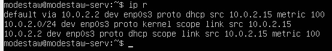
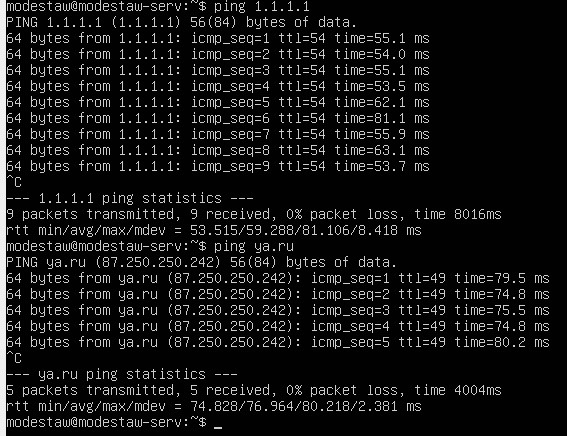
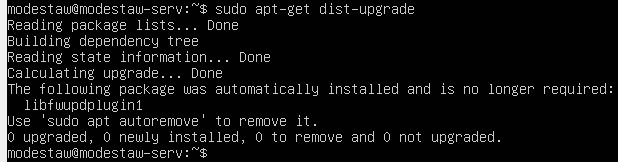
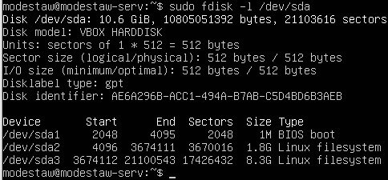

# Report
---
## Part 1. Installation of the OS

## Part 2. Creating a user
---
* Add user using sudo adduser command and gave the user admin rights using sudo

To see user's groups run command id \<user\>

* Result of cat /etc/passwd

## Part 3. Setting up the OS network
---
1. Set the machine name as user-1

2. Set the time zone corresponding to your current location

3. Output the names of the network interfaces using a console command

4. Use the console command to get the ip address of the device you are working on from the DHCP server
* The IP is 10.0.2.2

5. Define and display the external ip address of the gateway (ip) and the internal IP address of the gateway, aka default ip address (gw)
* Internal IP address of the gateway

* External IP address of the gaterway

6. Set static (manually set, not received from DHCP server) ip, gw, dns settings (use public DNS servers, e.g. 1.1.1.1 or 8.8.8.8)
* Open interface to edit

* Enter new values

* Enter the new dns server

* Restart the virtual machine

## Part 4. OS Update
---
* What to do to update the OS: apt-get update and sudo apt-get upgrade OS update 

## Part 5. Using the sudo command
---

* Sudo command grants root power to administrators (members of group admin or sudo) based on the rules defined in /etc/sudoers. sudo usermod -aG sudo second_admin
* Switch to the second user and change the hostname 

Sudo stands for either "substitute user do" or "super user do" and it allows you to temporarily elevate your current user account to have root privileges. This allows you to do everything that user can do on linux, so no restrictions on your actions anymore.

## Part 6. Installing and configuring the time service
---
* Install and set up Chrony to synchronize time: Synchronized using Chrony

## Part 7. Installing and using text editors
---
* To exit with the changes saved: ESC, :wq, ENTER

* To exit with the changes saved: control + x, y

* To exit with the changes saved: control + k, q, y

* To exit without saving changes: ESC, :q!, ENTER

* To exit without saving changes: control + x, n

To exit without saving changes: control + k, q, n

* Replacing using vim

* Replacing using nano: Command to find and substitute: Alt (Optinon key on Mac) + Shift + 5 then enter the string to find, string to replace the found string with and enter y to confirm replacement. select which occurrences to change Ctrl + X + C to exit, enter q to not save the changes and enter yes to exit even though there's modified buffer

* Replacing using joe: Command to find and substitute: Alt (Optinon key on Mac) + Shift + 5 then enter the string to find, string to replace the found string with and enter y to confirm replacement. select which occurrences to change Ctrl + X + C to exit, enter q to not save the changes and enter yes to exit even though there's modified buffer

## Part 8. Installing and basic setup of the SSHD service
---
* Installed and enabled the SSHd service

* Edit the file: $ sudo nano /etc/ssh/sshd_config

* Show the presence of the sshd process using the ps command. To do this, you need to match the keys to the command

* Reboot the system: $ sudo reboot

* Explain the meaning of the -tan keys, the value of each output column, the value 0.0.0.0. in the report:

-a - Displays all active connections and the TCP and UDP ports on which the computer is listening.

-n - Displays active TCP connections, however, addresses and port numbers are expressed numerically and no attempt is made to determine names.

-t - Displays only TCP connections.

Proto - The protocol of the connection.

Recv-Q - The data which has not yet been pulled from the socket buffer by the application. High Recv-Q means the data is put on TCP/IP receive buffer, but the application does not call recv() to copy it from TCP/IP buffer to the application buffer.

Send-Q - The data which the sending application has given to the transport, but has yet to be acknowledged by the receiving TCP. High Send-Q means the data is put on TCP/IP send buffer, but it is not sent or it is sent but not acknowledged. So, high value in Send-Q can be related to server network congest, server performance issue or data packet flow control.

Local Address – The IP address of the local computer and the port number being used.

Foreign Address – The IP address and port number of the remote computer to which the socket is connected.

State – Indicates the state of a TCP connection. The possible states are as follows: CLOSE_WAIT, CLOSED, ESTABLISHED, FIN_WAIT_1, FIN_WAIT_2, LAST_ACK, LISTEN, SYN_RECEIVED, SYN_SEND, and TIME_WAIT.

0.0.0.0 - The client devices like PCs show 0.0.0.0 address when they aren’t connected to any TCP/IP network. A device may get this address by default if it’s offline. In the case of address assignment failures, it may be automatically assigned by DHCP. Just in case your device is set to this address, it can’t talk to any other devices on the network over IP.

## Part 9. Installing and using the top, htop utilities:
---
* Install and run the top and htop utilities:

* uptime
number of authorised users
total system load
total number of processes
cpu load
memory load

* pid of the process with the highest memory usage

* sorted by PID

* sorted by PERCENT_CPU

* sorted by PERCENT_MEM

* sorted by TIME

* filtered for sshd process

* with the syslog process found by searching

## 10. Using the fdisk utility
---
* List all devices: $ sudo fdisk -l /dev/sda Go over each device to see extended info: $ sudo fdisk -l /dev/sda[number of the disk]

* Names of the disks, capacity and number of sectors:

* Write the swap size: Check the swap size: $ free -h

## Part 11. Using the df utility
---
* $ df /root Partition size, space used, space free, percentage used for the root partition:

* The measurement unit is 1k-blocks - 1024 bytes.

$ df -Th Partition size, space used, space free, percentage used for the root partition:

## Part 12. Using the du utility
* The size of the /home in bytes and human readable format:

* The size of the /var in bytes and human readable format:

* The size of the /var/log in bytes and human readable format:

* The size of all contents in /var/log:

* $ sudo du /var/log -a | less:

* $ sudo du /var/log -ah | less:

## Part 13. Installing and using the ncdu utility
---
* The size of the /home:

* The size of the /var:

* The size of the /var/log:

## Part 14. Working with system logs
* /var/log/dmesg – Contains kernel ring buffer information. When the system boots up, it prints number of messages on the screen that displays information about the hardware devices that the kernel detects during boot process.
* var/log/syslog - Logs everything, except auth related messages.
* var/log/auth.log - Contains system authorization information, including user logins and authentication machinsm that were used.
* The last successful login time, user name and login method:

* Stopped and restarted SSH:

## Part 15. Using the CRON job scheduler
---
* Using the job scheduler, run the uptime command in every 2 minutes:
crontab -e and select the text editor - To edit the configuration file. $ */2 * * * * uptime - New task added. Lines in the system logs (at least two within a given time range) about the execution:

* Display a list of current jobs for CRON $ crontab -l:

* Command 'Uptime' is launched every two minutes, grep -i cron /var/log/syslog:

* Remove all tasks from the job scheduler:

crontab -r - remove all tasks; $ crontab -l - list all tasks; The list of current tasks for CRON:

